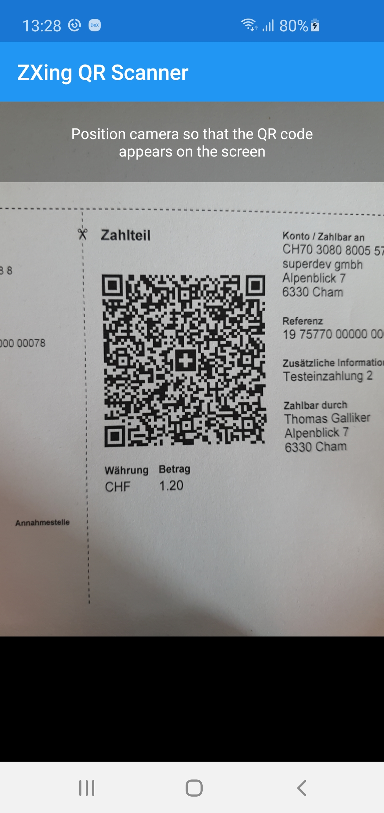
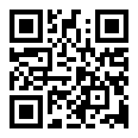

# QRScannerApp
Sample app for demonstrating the use of ZXing QR code scanner in a Xamarin Forms app.

#### Using the app
ScannerPage contains the ZXing control ZXingScannerView which is the canvas for drawing the camera preview. As soon as we set IsScanning to true, the camera is instructed to pump frames to ZXingScannerView. The analysis of each frame for a barcode happens after we set IsAnalyzing to true.
Each frame is then analyzed for the configured kind(s) of barcode (see MobileBarcodeScanningOptions -> PossibleFormats). The more formats are chosen, the more time it takes to analyze each frame.
If launched for the first time, the camera API asks for permission to access the camera.

#### Performance considerations
ZXing is often criticised for delivering significantly lower performance and accuracy when scanning complex (= big barcodes, badly printed, great distance between code and camera).
There are parameters in MobileBarcodeScanningOptions which can be used to tune the scan and analyze process. However, the default options fit the most use cases perfectly.
If you're still looking for a better solution, check out [Scandit barcode scanner SDK](https://www.scandit.com/products/barcode-scanning/).

#### Generating QR codes
- [QR Code Monkey](https://www.qrcode-monkey.com/){:target="_blank"}
- [QR Code Generator](https://www.qrcode-generator.ch/){:target="_blank"}
- [Swiss QR Bill Generator](https://www.codecrete.net/qrbill/bill){:target="_blank"}

